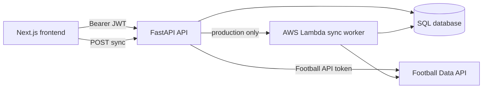

# Soccer Matches Codebase Documentation

> This document describes the implementation currently present in the repository. It was written from the application source, configuration, migration, and test files. The `/docs` directory was intentionally excluded.

## 1. System overview

Soccer Matches is a small monorepo with two independently runnable applications:

- **Backend:** FastAPI on Python, SQLAlchemy ORM, Pydantic v2 schemas, JWT authentication, and a Football Data API synchronizer.
- **Frontend:** Next.js 16 App Router application written in TypeScript and React 19.
- **Database:** SQLAlchemy models support SQLite and PostgreSQL-style deployment. Alembic contains a baseline migration.
- **Deployment shape:** The backend can run under Uvicorn or as an AWS Lambda handler through Mangum. Match synchronization can run in-process locally or be delegated to AWS Lambda in production.

The core user experience is:

1. A user creates an account or signs in.
2. The frontend stores a bearer JWT in `localStorage`.
3. Authenticated requests retrieve matches from the backend.
4. Each user can mark matches as completed independently of other users.
5. Users can hide scores globally, or reveal an individual score temporarily.
6. A refresh action starts a match-data synchronization when the previous synchronization is not fresh.

### High-level data flow

## 2. Repository layout

### Root files

- `package.json` defines the monorepo package metadata and identifies `frontend` as the AWS Amplify app root.
- `alembic.ini` points Alembic at `alembic/` and contains a placeholder SQLAlchemy URL for offline migration configuration.
- `CODEBASE.md` is this implementation reference.
- `.gitignore` excludes Python environments, Node dependencies, build output, databases, environment files, caches, and IDE artifacts.
- `.vscode/settings.json` adds `backend` to Python import paths and points the editor at `backend/venv/bin/python`.

### Backend

- `backend/app/main.py` creates the FastAPI application and defines all HTTP routes.
- `backend/app/config.py` contains synchronization and Lambda environment settings.
- `backend/app/database.py` creates the SQLAlchemy engine, declarative base, session factory, and FastAPI database dependency.
- `backend/app/models.py` defines database tables and relationships.
- `backend/app/schemas.py` defines Pydantic request and response models.
- `backend/app/dependencies.py` exposes a cached Football API client dependency; the current routes do not use it directly.
- `backend/app/services/football_api.py` integrates with `api.football-data.org`.
- `backend/app/services/sync_service.py` manages synchronization freshness metadata.
- `backend/app/scripts/sync_db.py` contains match synchronization, upserts, and the Lambda/CLI wrapper.
- `backend/app/utils/security.py` implements bcrypt password hashing and JWT authentication.
- `backend/app/utils/time_provider.py` supplies injectable time abstractions used by the API client and tests.
- `backend/Dockerfile` builds an AWS Lambda-compatible Python 3.13 image.
- `backend/requirements.txt` pins the Python runtime dependencies.
- `backend/pytest.ini` configures pytest discovery and strict markers.

### Frontend

- `frontend/app/layout.tsx` defines the root layout, fonts, metadata, and `UserProvider`.
- `frontend/app/page.tsx` implements the authenticated match-list screen and unauthenticated login screen.
- `frontend/context/UserContext.tsx` owns the JWT and persisted score-visibility preference.
- `frontend/components/UserLogin.tsx` implements login and account creation forms.
- `frontend/components/MatchCard.tsx` renders one match and manages optimistic completion updates.
- `frontend/components/RefreshButton.tsx` starts synchronization and displays freshness information.
- `frontend/types/matches.ts` contains frontend interfaces for matches, teams, competitions, and user-match records.
- `frontend/app/globals.css` imports Tailwind CSS and establishes global colors and typography.
- `frontend/package.json`, `frontend/tsconfig.json`, `frontend/next.config.ts`, `frontend/eslint.config.mjs`, and `frontend/postcss.config.mjs` configure the Next.js, TypeScript, ESLint, and Tailwind toolchain.

### Database migration

- `alembic/env.py` imports the backend metadata for autogeneration and loads `backend/.env` for online migrations.
- `alembic/versions/c1fd413d454f_recreate_initial_schema_baseline.py` creates the initial tables and indexes.

## 3. Backend application

### Application construction and middleware

`backend/app/main.py` creates a FastAPI app named `app` with title `Soccer Match Tracker API`, version `1.0.0`, and an empty lifespan context. It also creates `handler = Mangum(app)` for AWS Lambda/API Gateway integration.

CORS allows:

- `http://localhost:3000`
- `https://matchesqueue.com`
- `https://www.matchesqueue.com`
- `https://main.d1hthutgtmryew.amplifyapp.com`

Credentials, all methods, and all headers are enabled. There is also a catch-all `OPTIONS` route that returns manually specified CORS headers for the Amplify domain.

### Public and authenticated routes

| Method | Path | Authentication | Behavior |
|---|---|---:|---|
| `GET` | `/` | No | Returns API name, version, and a short endpoint listing. |
| `GET` | `/health` | No | Returns `{ "status": "healthy" }`. |
| `GET` | `/matches` | Yes | Returns paginated matches with the current user’s `is_done` state. |
| `POST` | `/users` | No | Validates and creates a user, returning a public user profile. |
| `POST` | `/token` | No | Accepts OAuth2 form fields `username` and `password`; `username` is treated as the email. |
| `POST` | `/api/matches/sync` | No | Runs or dispatches a match synchronization unless data is fresh. |
| `GET` | `/api/matches/sync/status` | No | Returns the last synchronization time and freshness. |
| `GET` | `/users/me` | Yes | Returns the authenticated user. |
| `DELETE` | `/users/me` | Yes | Deletes the authenticated user and cascaded user-match rows. |
| `PUT` | `/users/settings` | Yes | Updates the `hide_scores` preference. |
| `POST` | `/matches/{match_id}/status` | Yes | Creates or updates the current user’s completion state for a match. |

#### Match retrieval

`GET /matches` accepts:

- `hide_done`, default `false`
- `limit`, default `20`
- `offset`, default `0`

The query outer-joins `matches` to `user_matches` for the authenticated user. This preserves matches with no user-specific row and converts a missing completion value to `false`. Results are sorted by `utc_date` descending, then offset and limited.

When `hide_done=true`, rows whose user-specific `is_done` value is `true` are filtered out. The current implementation requires a JWT even though older test comments mention guest access.

#### Account creation and login

`POST /users` accepts an email and a password of at least six characters. Email validation is performed by `EmailStr`; duplicate emails return `400`. Passwords are bcrypt-hashed before insertion and are never included in the response.

`POST /token` uses `OAuth2PasswordRequestForm`, so clients must submit URL-encoded `username` and `password` fields. The user is looked up by email, the password is verified, and a bearer JWT is returned. Invalid credentials return `401` with a `WWW-Authenticate: Bearer` header.

#### User-specific completion state

`POST /matches/{match_id}/status?is_done=true|false` treats the path ID as the Football Data API’s `external_id`, not the database primary key. It finds or creates a `UserMatch` row for the current user and database match, then returns the external match ID and resulting state.

The list endpoint uses the same user-specific row to populate `MatchSchema.is_done`; one user’s completion state therefore does not affect another user.

#### Synchronization endpoints

The sync freshness key is `matches_sync`. Freshness defaults to a five-minute window. `POST /api/matches/sync` first checks freshness:

- Fresh: returns success with `Data is already fresh.`
- Local/non-production: calls `perform_sync` synchronously.
- Production: invokes the configured Lambda asynchronously with event payload `{ "source": "manual_api_trigger" }`.
- Exception: rolls back, records `FAILED` metadata, and returns `500`.

`GET /api/matches/sync/status` returns the last metadata timestamp, or `null` when no record exists, plus the current freshness boolean.

### Validation error behavior

The custom `RequestValidationError` handler returns only the first validation error. Invalid email messages are normalized to `Please enter a valid email address.`; other errors use the format `Invalid <field>: <message>`. This affects malformed user creation and other Pydantic validation failures.

## 4. Database model

The SQLAlchemy models are defined in `backend/app/models.py`.

### `teams`

- `id`: integer primary key.
- `external_id`: unique, indexed Football Data API identifier.
- `name`: required team name.
- `short_name`: optional display name.
- `tla`: optional three-letter abbreviation.

A team has two separate relationships to matches: `matches_as_home` and `matches_as_away`.

### `competitions`

- `id`: integer primary key.
- `external_id`: unique external competition identifier.
- `name`: competition name.
- `code`: competition code.

A competition has a one-to-many `matches` relationship.

### `matches`

- `id`: integer primary key.
- `external_id`: unique external match identifier.
- `utc_date`: required match date/time.
- `status`: API status such as `FINISHED`, `TIMED`, or `SCHEDULED`.
- `home_team_id` and `away_team_id`: foreign keys to `teams.id`.
- `competition_id`: foreign key to `competitions.id`.
- `score`: JSON score payload.
- `created_at`: UTC timestamp default.

A match belongs to one competition and has home/away team relationships. It can have many `UserMatch` rows.

### `users`

- `id`: integer primary key.
- `email`: unique, indexed, required login identifier.
- `hashed_password`: required bcrypt hash.
- `is_active`: defaults to `true`.
- `is_verified`: defaults to `false`; currently not enforced by authentication.
- `hide_scores`: defaults to `false`.

Users cascade-delete their `user_matches` rows through the ORM relationship.

### `user_matches`

This is the per-user join table:

- `user_id`: required foreign key to `users.id`.
- `match_id`: required foreign key to `matches.id`.
- `is_done`: completion flag, default `false`.
- `notes`: nullable future-facing text field.
- `last_updated`: timestamp with an update default/on-update expression.

The current API exposes completion state but does not expose or edit `notes`.

### `sync_metadata`

- `sync_key`: unique synchronization name.
- `last_run_at`: required timestamp.
- `status`: optional state such as `IN_PROGRESS`, `SUCCESS`, or `FAILED`.
- `last_error`: optional failure text.

The synchronization service creates or updates the `matches_sync` record.

### Database initialization

`backend/app/database.py` loads environment variables, reads `DATABASE_URL`, and defaults to `sqlite:///./soccer_tracker.db`. SQLite receives `check_same_thread=False`; other URLs receive no custom engine arguments. `get_db()` creates one session per request and closes it in a `finally` block.

## 5. Pydantic schemas and API serialization

The schemas in `backend/app/schemas.py` bridge SQLAlchemy objects, Football Data API data, and HTTP payloads.

- `TeamSchema` exposes the external team ID through the field name `id` and maps it to `Team.external_id` when reading ORM attributes.
- `CompetitionSchema` does the same for competitions.
- `ScoreValues` allows nullable home and away integers.
- `ScoreSchema` requires `duration` and `fullTime`, permits an optional `halfTime`, and allows additional API fields such as `extraTime`.
- `MatchSchema` exposes `match_id` as an alias of `Match.external_id`, includes nested teams and competition, and adds the user-specific `is_done` field.
- `UserCreate` validates email and enforces a six-character minimum password.
- `Token` and `TokenData` describe JWT payload/response concepts.
- `UserResponse` exposes only ID, email, and `hide_scores`.
- `UserMatchResponse` exposes user ID, external match ID, and completion state.
- `UserSettingsUpdate` contains the `hide_scores` boolean.

Because `populate_by_name=True` and aliases are used, the backend’s actual serialized match key is `external_id` under normal Pydantic alias serialization, while the internal schema field is `match_id`.

## 6. External football API client

`backend/app/services/football_api.py` defines `FootballAPIClient` for Football Data API v4.

### Supported competitions

The client maps these case-insensitive names to API competition IDs:

- `serie a` → `2019`
- `premier league` → `2021`
- `champions league` → `2001`
- `ligue 1` → `2015`
- `bundesliga` → `2002`
- `spanish league` → `2014`
- `world cup` → `2000`
- `euros` → `2018`

Unknown names raise `ValueError` before an HTTP request is made.

### Authentication and rate limiting

The token comes from the constructor or `FOOTBALL_DATA_API_TOKEN`. Requests send it as `X-Auth-Token`. The client enforces six seconds between requests, equivalent to ten requests per minute. Time and sleeping are injected through `TimeProvider`, which allows tests to advance virtual time without waiting.

### Fetching and transformation

`get_matches()` requests `/competitions/{competition_id}/matches` with `dateFrom` and `dateTo`. Missing dates default to today and the preceding seven days. Non-200 responses call `raise_for_status()`.

Each raw API match is transformed into a validated `MatchSchema` with:

- API `id` → `match_id`
- API `utcDate` → timezone-aware ISO datetime
- API home/away team objects → nested `TeamSchema` values
- API competition object → `CompetitionSchema`
- API score object → flexible `ScoreSchema`

The method returns both processed matches and raw records containing the API ID and full response object. `fetch_all_matches()` loops over all eight competitions, continues after an individual competition failure, and aggregates successful results.

## 7. Synchronization implementation

`backend/app/scripts/sync_db.py` owns the persistence pipeline.

### Date window selection

`get_sync_start_date()` finds the latest stored match and subtracts `LOOKBACK_DAYS` (seven days). If no match exists, it uses `DEFAULT_SYNC_START_DATE` (`2025-12-30`). The lookback allows recently changed or completed matches to be refreshed.

### Upserts

`upsert_competition()`, `upsert_team()`, and `upsert_match()` build PostgreSQL `INSERT ... ON CONFLICT DO UPDATE` statements keyed by `external_id`.

- Competition updates name and code.
- Team updates name, short name, and TLA.
- Match updates competition, status, date, teams, and score.

The match score is converted from the Pydantic object to a dictionary before being stored in the JSON column.

### `perform_sync()` lifecycle

1. Return immediately if `matches_sync` is fresh.
2. Record `IN_PROGRESS` metadata.
3. Create a `FootballAPIClient`.
4. Compute the start date.
5. Fetch all supported competitions.
6. Upsert competition, home team, away team, and match for each result.
7. Skip an individual match after logging its exception.
8. Commit all successful changes.
9. Record `SUCCESS` metadata.
10. On an outer failure, roll back and record `FAILED` metadata.

`sync_data()` creates and closes its own session and translates event payloads into a source label:

- no event → `local_script`
- `source == aws.events` → `scheduled`
- another source → that source, defaulting to `manual`

The module’s CLI entry point refuses to run when `DATABASE_URL` contains `sqlite`, then calls `sync_data()`.

## 8. Authentication and security

`backend/app/utils/security.py` uses Passlib’s bcrypt scheme and `python-jose` JWTs.

- `SECRET_KEY` must be set at import time; an empty value raises `RuntimeError`.
- JWT algorithm is HS256.
- Tokens expire after seven days by default.
- The subject (`sub`) contains the user email.
- `get_current_user()` decodes the bearer token, requires a subject, looks up the email, and returns `401` for decode or lookup failures.

The `is_active` and `is_verified` columns exist, but `get_current_user()` currently does not reject inactive or unverified users.

## 9. Frontend behavior

### Root layout

`frontend/app/layout.tsx` loads Geist fonts, imports global CSS, sets default Create Next App metadata, and wraps all pages in `UserProvider`.

### User context

`frontend/context/UserContext.tsx` stores:

- `token`: current JWT or `null`.
- `hideScores`: persisted user preference.
- `isLoadingSettings`: startup state while the saved token/profile is checked.

On mount, the provider reads `soccer_access_token` from `localStorage`, validates it through `GET /users/me`, and loads `hide_scores`. Invalid or failed profile requests call `logout()`.

`setToken()` stores the JWT under `soccer_access_token`. `logout()` clears both React state and local storage. `setHideScores()` updates the UI optimistically and sends `PUT /users/settings`.

### Login and account creation

`UserLogin` sends:

- Login: `POST /token` with URL-encoded `username=email` and `password`.
- Creation: `POST /users` with JSON `{ email, password }`.

It displays backend `detail` errors, supports showing/hiding the password, and moves focus from email to password when Enter is pressed in the email field.

### Match list page

`frontend/app/page.tsx` is a client component. Without a token it renders the login card. With a token it:

- Fetches `/matches` in pages of 20.
- Sends `limit`, `offset`, and `hide_done` query parameters.
- Deduplicates appended pages by `external_id`.
- Refreshes sync status every 30 seconds while logged in.
- Clears and reloads matches when the token or `hideDone` setting changes.
- Allows loading more matches.
- Optimistically updates completion status through `MatchCard`.
- Deletes the account through `DELETE /users/me`.
- Calls `RefreshButton` for synchronization.

The frontend additionally filters `matches` locally when `hideDone` is enabled, although the backend already supports the same filter.

### Match card

`MatchCard` displays the localized date, home and away short names, score, status, and a completion checkbox. Completion changes are optimistic: the local card and parent list update before `POST /matches/{external_id}/status` completes; a caught network error reverts both.

When `hideScores` is enabled, scores are blurred and individually clickable. Clicking reveals the score for that card. Turning the global setting back on hides all locally revealed scores. During initial settings loading, scores are also blurred unless locally revealed.

### Refresh button

`RefreshButton` disables itself while syncing or when `isFresh` is true. It calls `POST /api/matches/sync`, displays the returned message, and invokes the parent callback after any successful response. It converts the last sync timestamp into relative text and refreshes that text every minute.

The component explicitly handles `429`, although the current backend sync route does not return `429` itself.

## 10. Frontend/backend contract notes

The current implementation has several important contract details and inconsistencies:

1. **Account creation response mismatch:** `POST /users` returns `UserResponse`, not a token. `UserLogin.handleCreate()` calls `setToken(data.access_token)`, so account creation does not produce a valid JWT and may store an undefined value. The user must sign in separately unless this contract is changed.
2. **Match type is broader than backend output:** `frontend/types/matches.ts` describes fields such as `matchday`, `stage`, `last_updated`, `competition_id`, and nested competition data that `MatchSchema` does not return. The UI currently uses only `external_id`, `utc_date`, `status`, `score`, `home_team`, `away_team`, and `is_done`.
3. **Schema naming relies on aliases:** Backend code uses `match_id` internally, while the frontend reads `external_id`. This works because Pydantic aliases are emitted by default, but changing serialization settings would break the frontend.
4. **Sync routes are unauthenticated:** The UI only exposes them after login, but the backend does not require `get_current_user` for either sync route.
5. **PostgreSQL-specific upsert:** The synchronization code imports `sqlalchemy.dialects.postgresql.insert`, so the production sync path is designed for PostgreSQL. A SQLite database is the default application database, but SQLite execution of these statements is not equivalent to the PostgreSQL dialect.
6. **Alembic URL behavior:** Online migrations read `DATABASE_URL` from `backend/.env`; if absent, they construct an engine from an empty URL. Offline migrations use the placeholder URL in `alembic.ini`.
7. **No explicit page-level error state:** Match-fetch failures are logged and clear the list rather than showing a dedicated UI error.
8. **Completion rollback only catches rejected fetches:** `MatchCard` does not check `res.ok`, so HTTP error responses that resolve normally are not reverted.
9. **Potential duplicate user-match rows:** The model has no composite unique constraint on `(user_id, match_id)`. The endpoint normally reuses the first row, but concurrent requests could create duplicates.
10. **Verification is modeled but inactive:** `is_verified` is stored and tested as a future concern, but account verification is not implemented.

## 11. Tests

Tests are under `backend/tests` and use pytest, FastAPI `TestClient`, SQLAlchemy, mocks, and a SQLite test database.

- `conftest.py` defines test engines, transactional sessions, sample API payloads, mock time providers, authenticated headers, a persisted match fixture, and a session-wide user.
- `test_auth.py` covers successful login and invalid credentials.
- `test_football_api.py` covers token requirements, competition validation, request construction, date defaults, rate limiting, API errors, extraction of nested data, preservation of extra score fields, and all-competition aggregation.
- `test_main.py` covers root and health endpoints, match serialization, user-specific completion state, authentication requirements, pagination/filtering, validation formatting, sync execution modes, sync freshness, Lambda failures, and status responses.
- `test_security.py` covers bcrypt hashing, password verification, random salts, JWT claims, custom expiry, and signature rejection.
- `test_sync_db.py` covers date selection, PostgreSQL upsert statement shape, database failures, event-source routing, session cleanup, sync success/failure metadata, fresh-data short-circuiting, and the no-close behavior of `perform_sync()`.
- `test_sync_service.py` covers missing, stale, fresh, boundary, naive-datetime, create/update, and last-run metadata behavior.
- `test_user_interactions.py` covers ORM relationships between users, matches, and user-match rows.
- `test_user_logic.py` covers account creation, duplicate/short-password validation, completion toggling, missing matches/users, per-user isolation, profile access, deletion, cascade behavior, settings changes, and the currently non-enforced verification concept.

The fixtures use a session-scoped SQLite file and function-scoped transactions. The transaction is rolled back after each test, while the shared test user is inserted once for the session.

## 12. Configuration and runtime requirements

### Backend environment variables

- `DATABASE_URL`: SQLAlchemy database URL; defaults to local SQLite in application code.
- `SECRET_KEY`: required for importing the security module and signing/verifying JWTs.
- `FOOTBALL_DATA_API_TOKEN`: required unless a token is passed directly to `FootballAPIClient`.
- `ENV`: when equal to `production` case-insensitively, enables Lambda dispatch for sync.
- `LAMBDA_FUNCTION_NAME`: Lambda function name; defaults to `soccer-match-tracker-sync-worker`.

### Frontend environment variable

- `NEXT_PUBLIC_API_URL`: base URL concatenated with every backend route. The frontend expects this value to be defined at build/runtime.

### Commands represented by package configuration

Backend dependencies are listed in `backend/requirements.txt`; pytest uses `backend/pytest.ini`. Frontend scripts are defined in `frontend/package.json`:

- `npm run dev` starts Next.js development mode.
- `npm run build` creates a production build.
- `npm run start` serves the production build.
- `npm run lint` runs ESLint.

The backend can be run directly through the `if __name__ == "__main__"` block in `backend/app/main.py`, which launches Uvicorn on `127.0.0.1:8000`.

## 13. Operational summary

For a normal local workflow, the frontend runs on port 3000 and calls the backend base URL configured by `NEXT_PUBLIC_API_URL`. The backend imports `app` from `backend/app/main.py`, requires `SECRET_KEY`, connects using `DATABASE_URL` or the SQLite default, and uses `FOOTBALL_DATA_API_TOKEN` when a synchronization actually reaches the external API.

For production, the backend image is built from `backend/Dockerfile` using the AWS Lambda Python 3.13 base image. Mangum exposes the FastAPI application through `handler`. With `ENV=production`, a manual sync request invokes the configured worker Lambda asynchronously; the worker can call `sync_data()` with an AWS event source and persist results using the shared database URL.

## 14. Source-level limitations to keep in mind

This document describes behavior visible in code; it does not claim that deployment infrastructure, secrets, external Lambda configuration, database provisioning, or domain DNS are present in this repository. Those concerns are not encoded in the application source inspected here.
